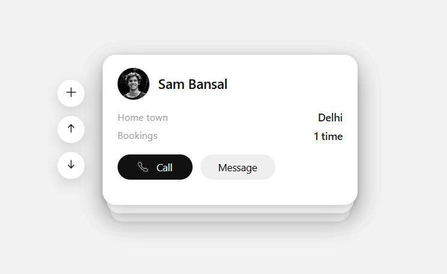
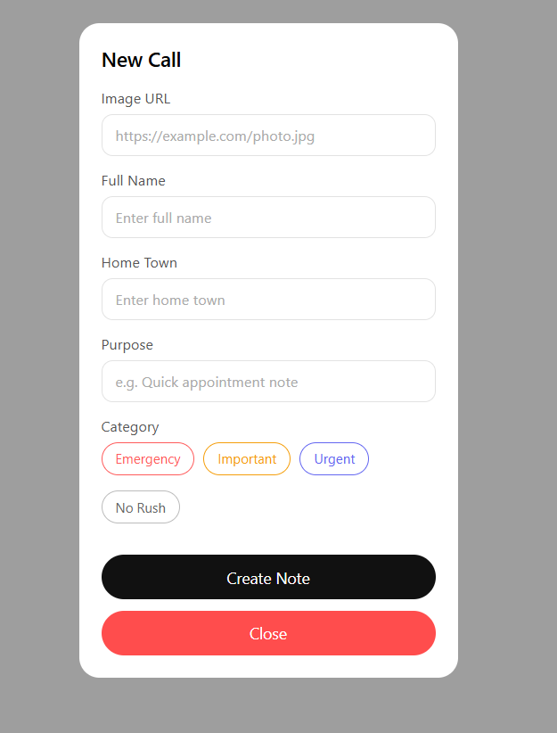

# Interactive Card Stack UI with Persistent Storage

An **interactive card stack interface** where users can **create, reorder, and persist cards** in the browser. Perfect for **dashboards, booking apps, task managers, or CRM systems**.  

## Features
- **Dynamic Cards:** Add new cards via modal form with validation.
- **Persistent Storage:** Cards are saved in `localStorage` so data persists across page reloads.
- **Stack Navigation:** Move cards up/down in the stack to change priority.
- **Responsive UI:** Works well on multiple screen sizes.
- **Interactive Actions:** Buttons for Call/Message for each card.

## Screenshots

